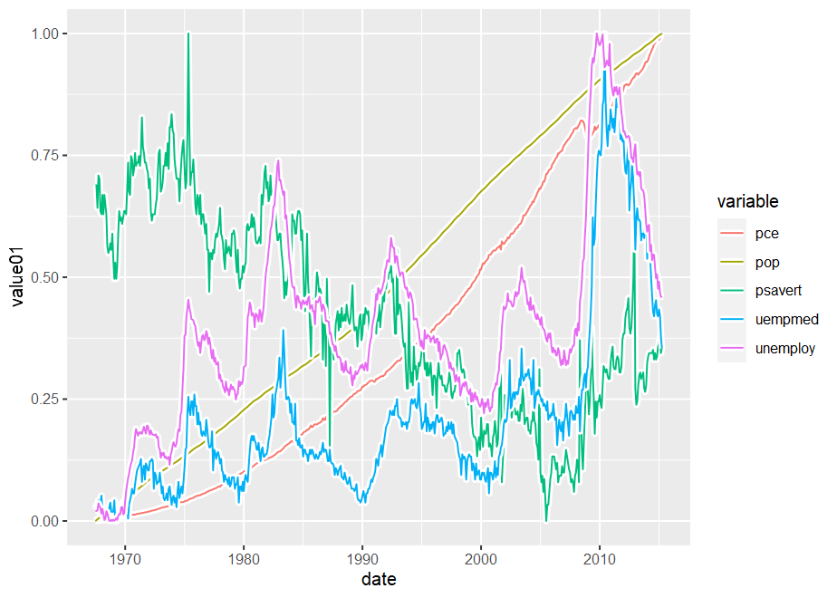
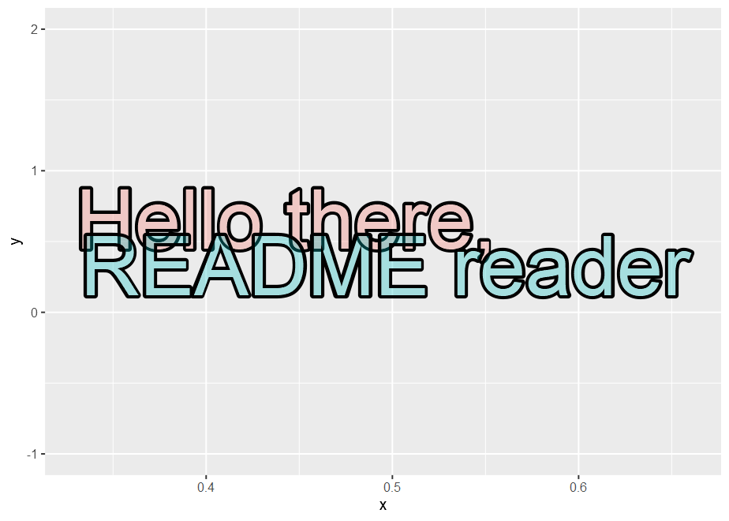
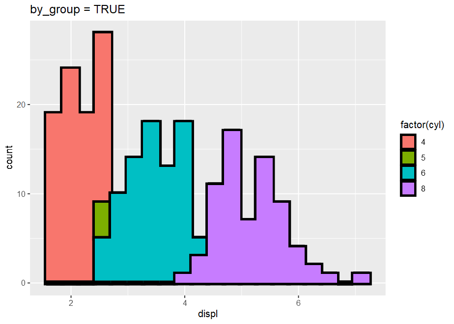
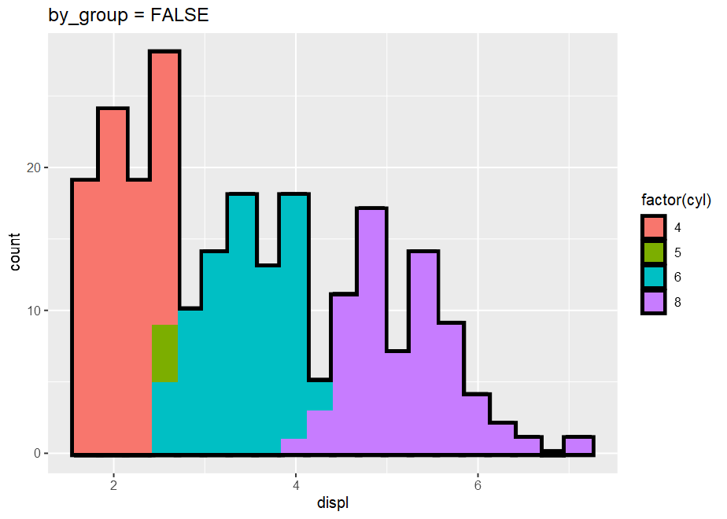
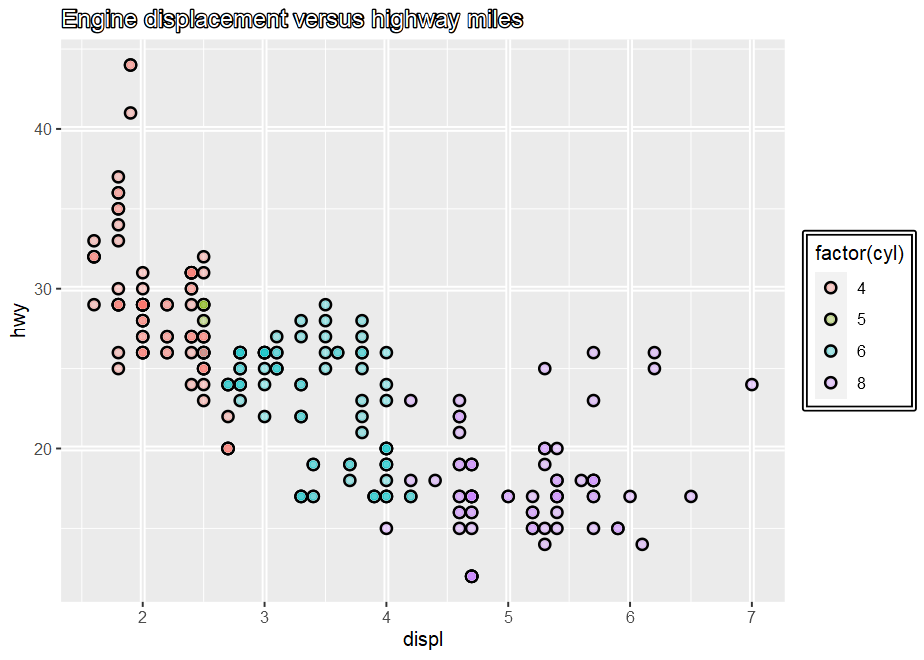

<!-- README.md is generated from README.Rmd. Please edit that file -->

# ggoutlines

<!-- badges: start -->

[](https://lifecycle.r-lib.org/articles/stages.html#experimental)
<!-- badges: end -->

The ggoutlines package extends the popular ggplot2 plotting package by
providing popular geometry layers and theme elements that can be
outlined.

## Installation

You can install the development version of ggoutlines from
[GitHub](https://github.com/) with:

``` r
# install.packages("devtools")
devtools::install_github("teunbrand/ggoutlines")
```

> **Warning** {ggoutlines} has adopted the ‘linewidth’ aesthetic in the
> development version of the {ggplot2} package. It is not compatible
> with earlier versions of {ggplot2}.

## Example

The idea here is that there are variants of classic ggplot2 functions
that draw the same thing, but with outlines. Below is a simple example
of a lineplot, where the lines have white outlines.

``` r
library(ggoutlines)
#> Loading required package: ggplot2

ggplot(economics_long, aes(date, value01, colour = variable)) +
  geom_path_outline(
    stroke_colour = "white",
    stroke_linewidth = 2
  )
```



Some extra attention is paid to the transparency settings, ensuring that
everything works ‘as expected’ with semi-transparent colours.

``` r
df <- data.frame(
  x = c(0.33, 0.66),
  y = c(0.66, 0.33),
  lab = c("Hello there,", "README reader")
)

ggplot(df, aes(x, y, label = lab, colour = lab)) +
  geom_text_outline(
    stroke_colour = "black",
    stroke_linewidth = 3, alpha = 0.3,
    size = 20, hjust = c(0, 1),
    show.legend = FALSE
  ) +
  ylim(c(-1, 2))
```



Most geoms have to option to either turn of or turn on grouped outlines.
Turning it off gives the layer as a whole an outline, whereas turning it
on will give groups outlines.

``` r
p <- ggplot(mpg, aes(displ, fill = factor(cyl)))

p + geom_histogram_outline(by_group = TRUE, bins = 20) +
  labs(title = "by_group = TRUE")
p + geom_histogram_outline(by_group = FALSE, bins = 20) +
  labs(title = "by_group = FALSE")
```



Aside from providing geom layers, you can also use outlined theme
elements.

``` r
ggplot(mpg, aes(displ, hwy, colour = factor(cyl))) +
  geom_point_outline(alpha = 0.3) +
  labs(title = "Engine displacement versus highway miles") +
  theme(
    plot.title        = element_text_outline(colour = "white"),
    legend.background = element_rect_outline(colour = "white", fill = NA),
    panel.grid.major  = element_line_outline(
      stroke_colour = "white", colour = "grey92"
    )
  )
```



## Limitations

At the moment of writing, not many graphics devices in R support the use
of the recent additions in the {grid} package (\> R4.2.0). Since
{ggoutlines} relies on this functionality, it is recommended to use the
‘cairo-png’ device for raster output.

Here is a list of missing functionality:

- The `linetype` for lines is not properly implemented for the outlines.

## Related packages

Some packages that implement similar functionality as {ggoutlines} are
[shadowtext](https://github.com/GuangchuangYu/shadowtext),
[ggtrace](https://github.com/rnabioco/ggtrace) and
[ggborderline](https://wurli.github.io/ggborderline/).
